# 📖 GrainMall.github.io 学习开发记录
>  **GrainMall.github.io 谷粒商城 学习自尚硅谷的学习笔记以及项目开发**

> [Java项目《谷粒商城》Java架构师 | 微服务 | 大型电商项目_哔哩哔哩_bilibili](https://www.bilibili.com/video/BV1np4y1C7Yf?p=1)
>
> # Java架构师 | 微服务 | 大型电商项目
>
> 好好学习哦~ 这里是项目总结以及学习笔记 ~

> **谷粒商城——微服务架构图**

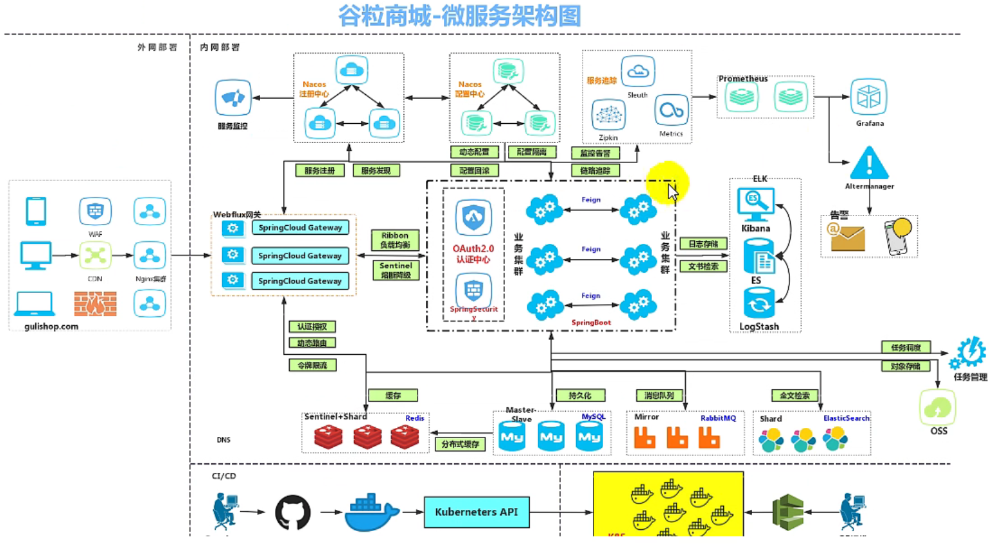

> **谷粒商城——项目微服务划分图**

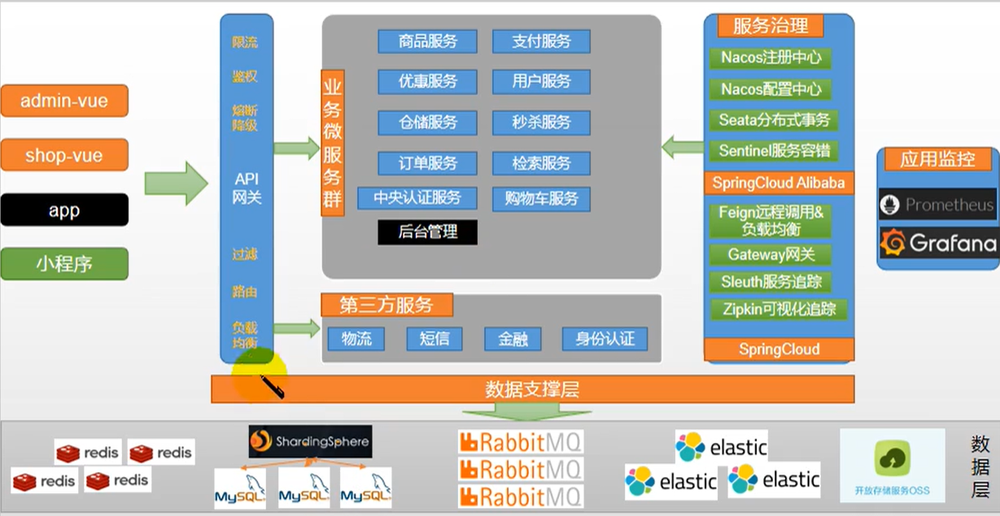

## :bookmark_tabs: **前置项目所需以及技术栈要求**

### :bookmark: 项目技术以及特色

- **前后分离开发，并开发基于 vue 的后台管理系统**

- **SpringCloud** 全新的解决方案
-  **应用监控、限流、网关、熔断降级**等分布式方案全方位涉及
-  透彻讲解**分布式事务、分布式锁**等分布式系统的难点
-  分析**高并发场景的编码方式，线程池，异步编排**等使用
-  **压力测试与性能优化**
-  各种**集群技术的区别以及使用**
-  **CI/CD 使用**
- ... ...

### :bookmark: 技术栈

- **SpringBoot**
- **SpringCloud、SpringCloud Alibaba**
- **git、Maven3.6.3**
- **Linux CentOS/7.6、Redis6.2.6、docker20.10.7**
- **html、css、js、Vue**
- **MySQL 5.7**

### :bookmark: 项目成果展示


## :bookmark_tabs: 分布式基础篇（全栈开发篇）

## :bookmark: 分布式基础概念

#### :star: 微服务 & 集群 & 分布式 & 节点

> **微服务**

**简而言之：拒绝大型单体应用、基于业务边界进行服务微型化拆分，各个服务独立部署运行。**

> **集群**

**集群只是个物理形态、分布式是工作方式。 只要是一堆机器，就可以称之为集群，**他们是否一致协同工作，谁也不知道。

> **分布式**

“**分布式系统是若干个独立计算机的集合**，这些计算机对用户来说就像是**单个相关系统**”——《分布式系统原理与范型》

**分布式系统是建立在网络之上的软件系统**

:books: **注意点：**

- **分布式是将不同的业务分布在不同的地方**
- **集群是指几台服务器集中在一起，实现同一业务。**
- **分布式中的每一个节点，都可以视作为集群。而集群并不一定就是分布式的。**

> **节点**

**集群中的一个服务器称之为节点。**

#### :star: 远程调用

> **远程调用**

**在分布式系统，各个服务可能处于不同主机，但是服务之间不可避免的需要互相调用，我们称之为远程调用。**

- SpringCloud 中 使用 Http + JSON 的方式实现远程调用


#### :star: 负载均衡

> **负载均衡**


分布式系统中——如果服务A需要调用B服务，B服务在多态及其中都存在，A调用任意一个服务器均可以完成功能。

为了使每一个服务器都**不会太“忙”或者太“闲”**，可以**使用负载均衡的调用每一个服务器**，提升网站的健壮性。（**例如Nginx 负载均衡**）

:books: **常见均衡算法：**

- **轮询：**为第一个请求选择的健康池中的第一个后端服务器，然后按照顺序往后依次进行选择，直到最后一个，然后循环。
- **最小连接：**优先选择连接数最少，也就是压力最小的后端服务器。（**会话较长时可以选用当前情况**）
- **散列：** 根据请求源的IP的散列（hash）来选择进行转发的服务器。

#### :star: 服务注册/ 发现 & 注册中心

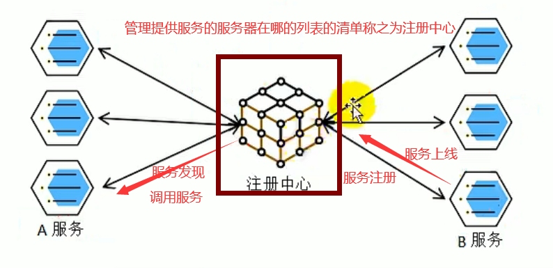

> **服务注册** / **服务发现**

**服务一上线把其注册到注册中心当中，别人想要调用该服务则去服务中心中发现。**

> **注册中心**

整个维护哪些服务在哪些机器，**这个维护清单称之为注册中心**。

#### :star: 配置中心

> **配置中心**

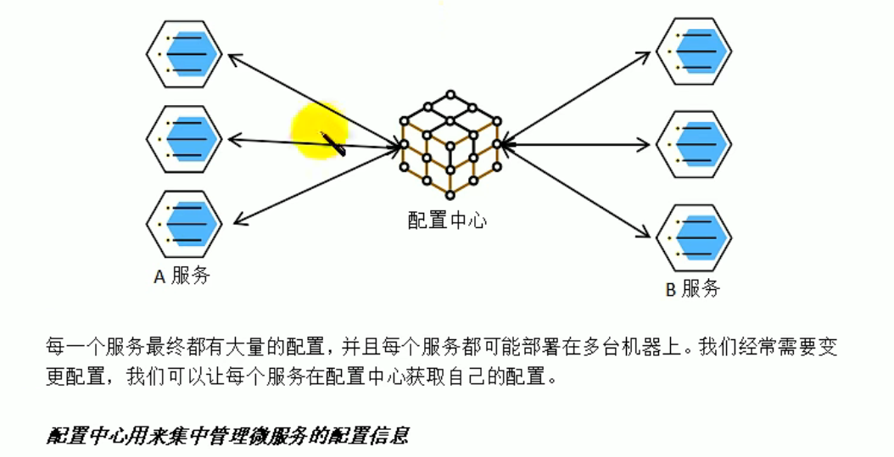

**:books: 配置中心用来集中管理微服务的配置信息**

#### :star: 服务熔断 & 服务降级

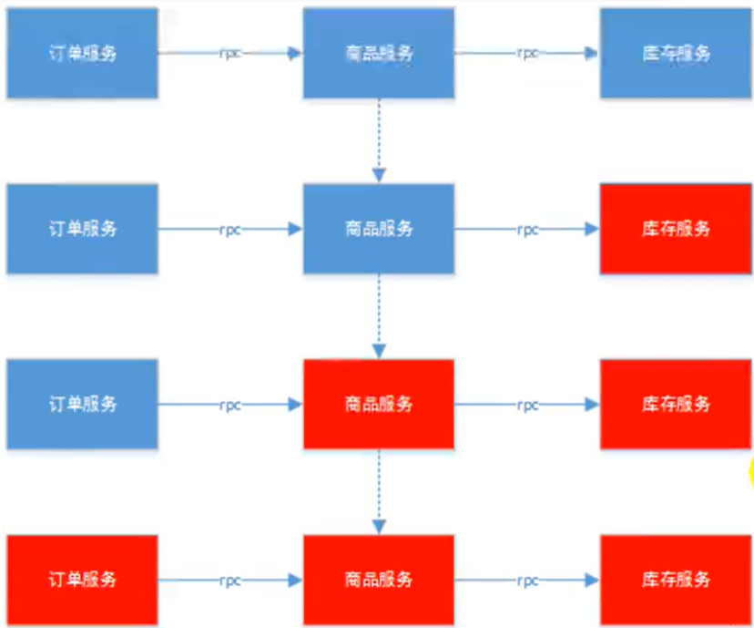

**:books: 导致服务链阻塞，服务积压等最终导致服务雪崩的现象。**

因为在微服务架构当中，**微服务之间通过网络进行通信，存在相互依赖**，当其中**一个服务不可用（服务器宕机等因素发生时）**，有可能会发生**雪崩效应**。要访问这样的情况，**必须要有容错机制来保护服务。**

> **服务熔断**

- 设置服务超时时间，当被调用的服务经常失败到达了某个阈值，**我们可以开启熔断保护机制**，后来的**请求不再去调用这个服务，直接本地返回默认的数据。**

> **服务降级**

- 在运维期间，如果系统处于高峰期，系统资源紧张，**我们可以让非核心业务进行降级运行。**降级：某些服务不处理，或者简单地进行处理（**抛出异常、返回NULL、调用Mock数据、调用Fallback处理逻辑**）

#### :star: API 网关

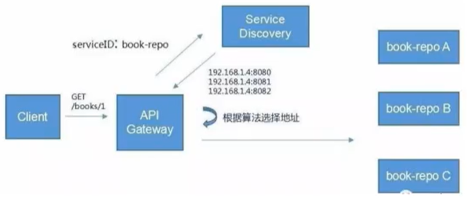

在微服务架构当中，API GateWay 作为整体架构的重要组件，*它抽象了微服务中都需要的公共功能，同时提供了客户端——负载均衡，服务自动熔断，灰度发布，统一认证，限流流控，日志统计等*丰富的**功能，帮助我们解决很多API管理难题。**

## :bookmark: 环境搭建

> [分布式集群搭建第一步之——如何在 Virtual Box 上安装 `CentOS 7.6` 并且配置好 Java 环境 的同时 主机与虚拟机互通_](https://alascanfu.blog.csdn.net/article/details/123938156)

>  **Vagrant官网**:**[Downloads | Vagrant by HashiCorp (vagrantup.com)](https://www.vagrantup.com/downloads)**
>
>  **安装 VirtualBox 等**

> **这里不演示了，小付这里使用的Virtual Box根据iso镜像文件直接创建**

> **记得要修改好网络配置——不可将其配置为网络地址转换-端口转换**

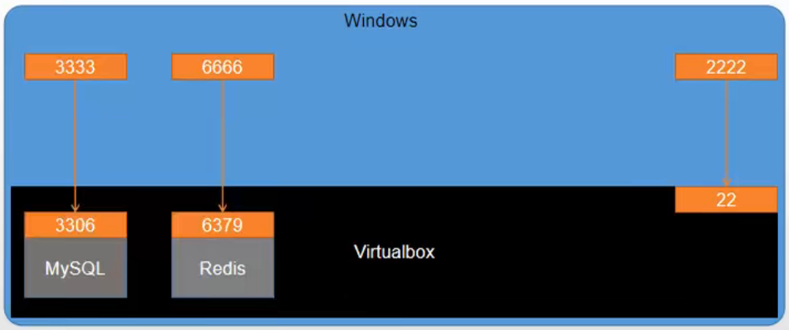

#### :star: 安装 Docker

> 官方网站：[Home - Docker](https://www.docker.com/)
>
> 官方Docker hub: [Docker Hub](https://hub.docker.com/)
>
> Docker 官方文档:[Docker Documentation | Docker Documentation](https://docs.docker.com/) 

> **什么是docker？**

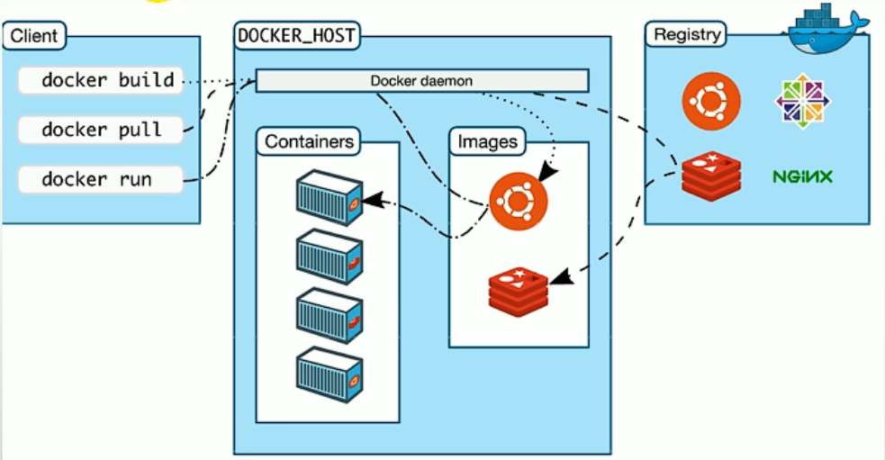

虚拟化容器的技术，**Docker基于镜像，可以秒级启动各种容器**。**每一种容器都是一个完整的运行环境，容器之间互相隔离。**

> **步骤1：卸载系统之前存在的docker**

```shell
# 卸载系统之前存在的 docker
$ sudo yum remove docker \
  docker-client \
  docker-client-latest \
  docker-common \
  docker-latest \
  docker-latest-logrotate \
  docker-logrotate \
  docker-engine
```

> **步骤2：设置 docker 镜像地址**

:books: 安装所需的软件包。**yum-utils 提供了 yum-config-manager** ，并**且 device mapper 存储驱动程序需要 device-mapper-persistent-data 和 lvm2。**

```shell
# 安装docker所必需的依赖的软件 如 yum-utils 以及 device mapper 依赖的 device-mapper-persistent-data 和 lvm2
$ sudo yum install -y yum-utils \
  device-mapper-persistent-data \
  lvm2
```

**:books: 设置对应的下载镜像路径，可以选取国内的仓库地址**

```shell
# 设置镜像仓库地址
$ sudo yum-config-manager \
    --add-repo \
    https://download.docker.com/linux/centos/docker-ce.repo
# 设置采用 阿里云的镜像仓库地址
$ sudo yum-config-manager \
    --add-repo \
    http://mirrors.aliyun.com/docker-ce/linux/centos/docker-ce.repo
# 设置采用 清华大学的镜像仓库地址
$ sudo yum-config-manager \
    --add-repo \
    https://mirrors.tuna.tsinghua.edu.cn/docker-ce/linux/centos/docker-ce.repo
```

> **步骤三：安装 docker**

```shell
# 安装最新版本的 Docker Engine-Community 和 containerd，或者转到下一步安装特定版本：
$ sudo yum install docker-ce docker-ce-cli containerd.io
```

:books: **注意点：有多个 Docker 仓库吗？**

如果启用了多个 Docker 仓库，则在**未在 yum install 或 yum update 命令中指定版本的情况**下，进行的**安装或更新将始终安装最高版本，这可能不适合您的稳定性需求。**

```shell
# 列出并排序您存储库中可用的版本。此示例按版本号（从高到低）对结果进行排序。
$ yum list docker-ce --showduplicates | sort -r
```

**通过其完整的软件包名称安装特定版本**，该软件包名称是软件包名称（docker-ce）加上版本字符串（第二列），从第一个冒号（:）一直到第一个连字符，并用连字符（-）分隔。**例如：docker-ce-18.09.1。**

```shell
# 安装指定版本的 docker-ce 以及 docker-ce-cli 和 containerd.io
$ sudo yum install docker-ce-<VERSION_STRING> docker-ce-cli-<VERSION_STRING> containerd.io
```

> **步骤四：启动 docker**

```shell
$ sudo systemctl start docker
$ docker -v # 显示当前 docker 的版本
Docker version 20.10.17, build 108c701
# 查看当前 docker 镜像
$ sudo docker images
# 开机自动启动 docker
$ sudo systemctl enable docker
```

> **步骤五：配置阿里云的docker容器镜像服务**

```http
https://cr.console.aliyun.com/cn-hangzhou/instances/mirrors
```


```shell
# 创建 配置的 docker 目录
$ sudo mkdir -p /etc/docker
# 配置 docker 镜像
$ sudo tee /etc/docker/daemon.json <<-'EOF'
{
  "registry-mirrors": ["https://xxxxxxxx.mirror.aliyuncs.com"]
}
EOF
# 守护进程重新加载
sudo systemctl daemon-reload
# 重启 docker 服务
sudo systemctl restart docker
```

#### :star: 通过 Docker 安装 MySQL

> **步骤一：下载镜像文件**

```shell
# 下载 MySQL 5.7 版本的 镜像到 Docker 中
$ sudo docker pull mysql:5.7
# 查看当前 docker 仓库中的镜像
$ sudo docker images 
REPOSITORY   TAG       IMAGE ID       CREATED        SIZE
mysql        5.7       c20987f18b13   5 months ago   448MB
```

> **步骤二：创建实例并且启动**

```shell
$ sudo docker run -p 3306:3306 --name mysql \
-v /mydata/mysql/log:/var/log/mysql \
-v /mydata/mysql/data:/var/lib/mysql \
-v /mydata/mysql/conf:/etc/mysql \
-e MYSQL_ROOT_PASSWORD=root \
-d mysql:5.7

# 查看当前 docker 中正在运行的实例
$ sudo docker ps
# 然后可以通过 Navicat 进行尝试连接对应 ip 地址下的mysql服务
```

:books: **参数说明：**

**如何进入镜像容器的完整运行环境**

```shell
# 以交互的形式进入到对应 NAMES 或者 CONTAINER ID 的容器当中的/bin/bash控制台
$ sudo docker exec -it mysql /bin/bash # 或者这里输入 CONTAINER ID

root@e63c33cd9fe2:/# ls /
bin   dev			  entrypoint.sh  home  lib64  mnt  proc  run   srv  tmp  var
boot  docker-entrypoint-initdb.d  etc		 lib   media  opt  root  sbin  sys  usr
# 退出镜像容器控制台
root@e63c33cd9fe2:/# exit
```

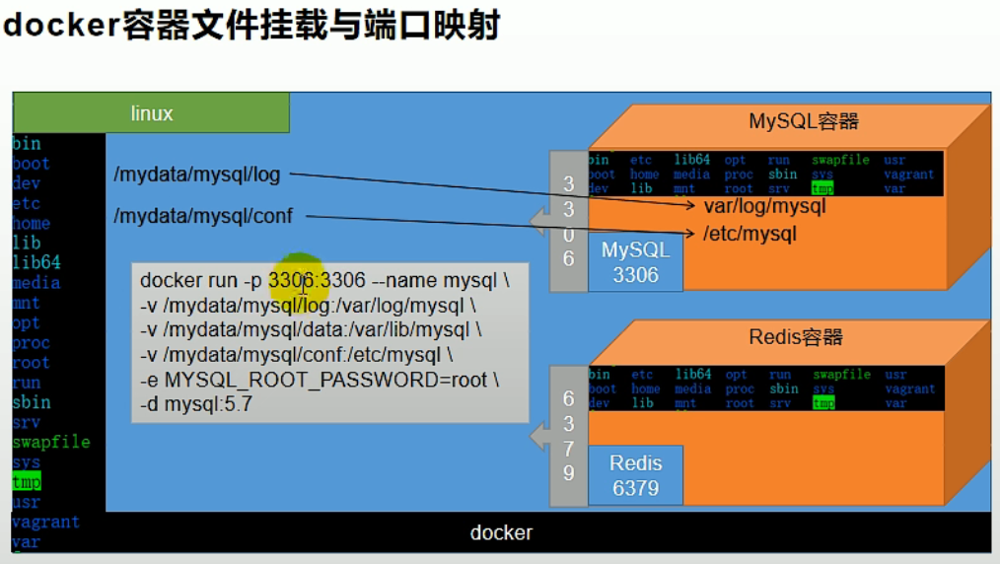

*可以发现每一个镜像容器都是一个小型的系统。*

- **MySQL5.7 装入到了 MySQL容器**当中 ,**MySQL默认会占用端口为3306作为服务端口**，但是这个MySQL5.7的端口**只是在对应的MySQL容器当中内部用的端口**，所以我们需要将MySQL容器中的3306端口映射到Linux系统下的3306端口 这也就是为什么配置 `docker run -p 3306:3306` ,**第一个 3306 代表的是Linux虚拟机的3306端口 、第二个3306代表的是MySQL容器中的端口映射对应。**

****

```shell
> -v /mydata/mysql/log:/var/log/mysql \
> -v /mydata/mysql/data:/var/lib/mysql \
> -v /mydata/mysql/conf:/etc/mysql \
```

- `-v` **代表的是目录挂载  第一个路径代表的是镜像常需要进行修改的文件信息映射到Linux系统下的路径、第二个路径代表的是映射的是镜像中的哪个路径** , 两个路径之间用 `:` 隔开。

```shell
> -e MYSQL_ROOT_PASSWORD=root \
```

- `-e` 代表的是对MySQL的**一系列参数**进行修改,**如这里的MYSQL_ROOT_PASSWORD进行修改**

```shell
> -d mysql:5.7
```

- `-d` 代表的是开启对应的哪个映射以及版本

> **步骤三：配置 MySQL 配置文件**

:books: 上述介绍了**挂载以及镜像映射的相关概念**，此时**如果我们需要进行修改 Docker 容器中 MySQL 镜像中的MySQL 5.7 的配置文件**，即**可以直接回到Linux系统中的对应映射路径进行修改**即可。

```shell
# 配置 MySQL 配置文件
$ sudo vim /mydata/mysql/conf/my.cnf

# 配置完成之后 重启 docker 服务
$ sudo docker restart mysql

# restart 之后记得查看启动镜像列表是否有对应的镜像启动
$ sudo docker ps
```

**/mydata/mysql/conf/my.cnf**

```txt
[client]
default-character-set=utf8
[mysql]
default-character-set=utf8
[mysqld]
init_connect='SET collation_connection = utf8_unicode_ci' 
init_connect='SET NAMES utf8' 
character-set-server=utf8
collation-server=utf8_unicode_ci
skip-character-set-client-handshake
skip-name-resolve
```

**:books: 注意：解决MySQL连接慢的问题**

在配置文件中加入如下 配置，重启容器镜像即可：

**解释：skip-name-resolve：跳过域名解析**

```shell
[mysqld]
skip-name-resolve
```

> **步骤四：通过Linux命令行进入MySQL容器中的MySQL5.7的服务并进行相关设置**

```shell
$ sudo docker exec -it mysql mysql -u root -p
```

- **设置 root 远程访问**

```sql
mysql> grant all privileges on *.* to 'root'@'%' identified by 'root' with grant option;
Query OK, 0 rows affected, 1 warning (0.00 sec)

mysql> flush privileges;
Query OK, 0 rows affected (0.00 sec)
```

#### :star: 通过 Docker 安装 Redis

> **步骤一：通过docker拉取redis镜像**

```shell
$ sudo docker pull redis
```

> **步骤二：创建实例并启动**

```shell
# 在linux虚拟机系统中创建对应的容器中镜像redis映射的目录
$ sudo mkdir -r /mydata/redis/conf
# 创建映射 redis.conf 的配置文件 
$ sudo touch /mydata/redis/conf/redis.conf

# 创建镜像实例 并且挂载映射位置
$ sudo docker run -p 6379:6379 --name redis \
-v /mydata/redis/conf/redis.conf:/etc/redis/redis.conf \
-v /mydata/redis/data:/data \
-d redis redis-server /etc/redis/redis.conf
```

> **步骤三：测试连接 redis-cli**

```shell
# 查看当前运行的 docker 容器镜像实例
$ sudo docker ps 
# 登录到 redis-cli 测试
$ sudo docker exec -it redis redis-cli
```

> **步骤四：通过映射挂载目录配置持久化Redis**

```shell
$ vim /mydata/redis/conf/redis.conf

# 配置完成之后 重启docker 容器中 redis镜像实例
$ sudo docker restart redis 

# 通过查看 当前 运行的docker 容器中的镜像实例 检验是否重启成功
$ sudo docker ps
```

**/mydata/redis/conf/redis.conf**

```txt
appendonly yes
```

> **如果需要对 redis 进行配置可以查看相关文档进行客制化配置**
>
> [Documentation | Redis](https://redis.io/docs/)
>
> https://raw.githubusercontent.com/redis/redis/6.2/redis.conf

#### :star: 开发环境统一

> **Maven 配置jdk1.8编译项目 、 以及国内镜像下载源**

```powershell
C:\Users\Alascanfu>java -version
java version "1.8.0_301"
Java(TM) SE Runtime Environment (build 1.8.0_301-b09)
Java HotSpot(TM) 64-Bit Server VM (build 25.301-b09, mixed mode)

C:\Users\Alascanfu>mvn -version
Apache Maven 3.8.1 (05c21c65bdfed0f71a2f2ada8b84da59348c4c5d)
Maven home: F:\apache-maven-3.6.1\bin\..
Java version: 1.8.0_301, vendor: Oracle Corporation, runtime: C:\Program Files\Java\jdk1.8.0_301\jre
Default locale: zh_CN, platform encoding: GBK
OS name: "windows 10", version: "10.0", arch: "amd64", family: "windows"
```

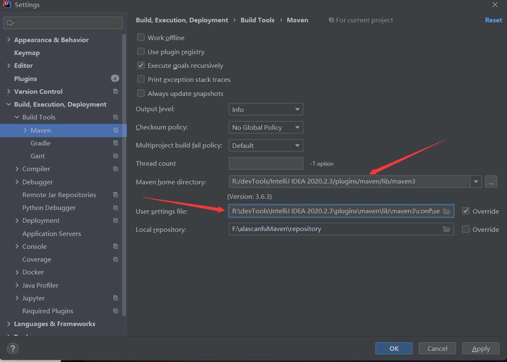

**配置阿里云镜像下载地址**

```xml
<mirrors>
	<mirror>      
      <id>nexus-aliyun</id>    
      <name>Nexus aliyun</name>  
      <url>http://maven.aliyun.com/nexus/content/groups/public</url>
      <mirrorOf>central</mirrorOf>      
    </mirror>
</mirrors>
```

**配置jdk版本控制**

```xml
<prifiles>
	<profile>    
     <id>jdk-1.8</id>    
     <activation>    
        <activeByDefault>true</activeByDefault>    
        <jdk>1.8</jdk>    
      </activation>    
	  <properties>    
	    <maven.compiler.source>1.8</maven.compiler.source>    
	    <maven.compiler.target>1.8</maven.compiler.target>    
	    <maven.compiler.compilerVersion>1.8</maven.compiler.compilerVersion>    
	  </properties>    
	</profile>
</profiles>
```

**IDEA 中 plugin 安装**

- **Lombok 2020.2**
- **MyBatisX 1.5.4**

> **前端开发IDE选择 VS Code**

[Visual Studio Code - Code Editing. Redefined](https://code.visualstudio.com/)

> **VSCode 插件安装与选择**

- Vetur —— 语法高亮、智能感知、Emmet 等 包含格式化功能， Alt+Shift+F （格式化全文），Ctrl+K Ctrl+F（格式化选中代码，两个 Ctrl 需要同时按着） 

- EsLint —— 语法纠错 

- Auto Close Tag —— 自动闭合 HTML/XML 标签 

- Auto Rename Tag —— 自动完成另一侧标签的同步修改 

- JavaScript(ES6) code snippets — — ES6 语 法 智 能 提 示 以 及 快 速 输 入 ， 除 js 外 还 支持.ts，.jsx，.tsx，.html，.vue，省去了配置其支持各种包含 js 代码文件的时间 

- HTML CSS Support —— 让 html 标签上写 class 智能提示当前项目所支持的样式 

- HTML Snippets —— html 快速自动补全 

- Open in browser —— 浏览器快速打开 

- Live Server —— 以内嵌服务器方式打开 

- Chinese (Simplified) Language Pack for Visual Studio Code —— 中文语言包

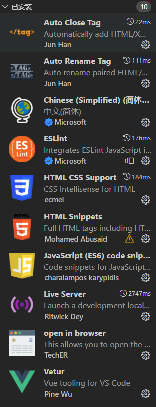

#### :star: 配置 git

> **快速并上手使用** Git ：[Git 是什么 - Gitee.com](https://gitee.com/help/articles/4104)

> 官方下载并安装 **下载 git；https://git-scm.co**

> **步骤一：用户信息的相关配置**

```shell
# 个人用户名称 配置为当前用户下 --global
$ git config --global user.name "Alascanfu"
# 个人用户电子邮箱地址 配置为当前用户下 --global
$ git config --global user.email "JiaweiFuCN@gmail.com"
```

> **步骤二：生成/添加SSH公钥 免密登录到仓库**

> [生成/添加SSH公钥 - Gitee.com](https://gitee.com/help/articles/4181#article-header0)

> **步骤三：在仓库中的设置添加好对应的公钥**

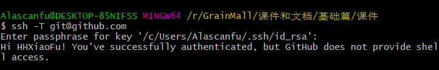

#### :star: 创建项目微服务

商品服务、仓库服务、订单服务、优惠券服务、用户服务

> **从github初始化一个项目之后导入到IDEA中 File -> new Project From Version Control**

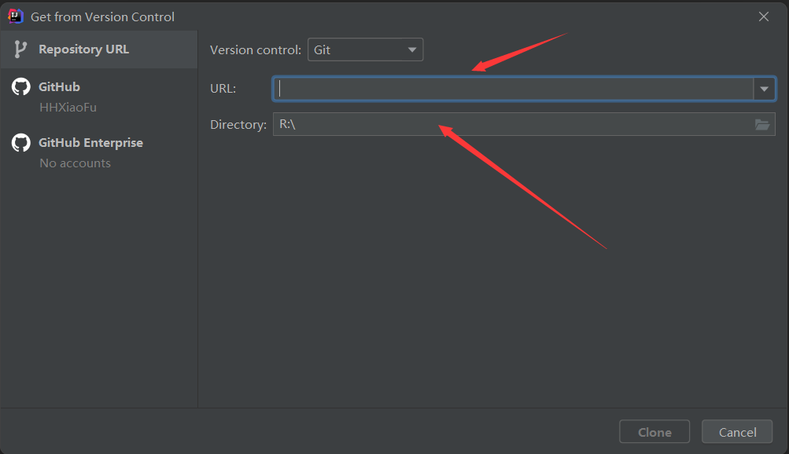

> **创建第一个微服务模块——商品服务**

:books: **注意点：**

**1、每一个服务模块都先导入 SpringWeb 、 与SpringCloud Routing中的 OpenFeign**

**2、每一个服务模块包名为 com.alascanfu.grainmall.xxx(product/order/ware/coupon/member)**

**3、每一个模块的模块名为grainmall-xxx**

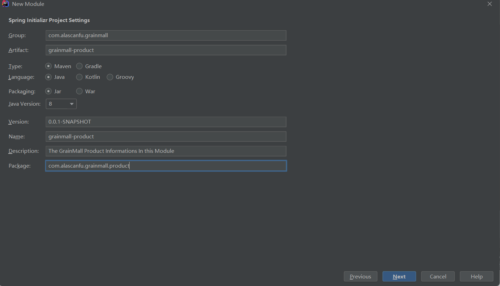

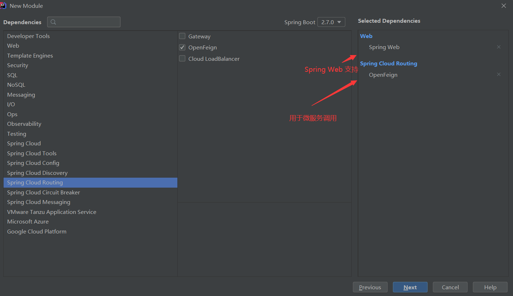

> **步骤二：创建所有模块之后在 GrainMall.github.io 中创建pom.xml 文件将所有创建好的模块进行聚合**

**pom.xml**

```xml
<?xml version="1.0" encoding="UTF-8"?>
<project xmlns="http://maven.apache.org/POM/4.0.0" xmlns:xsi="http://www.w3.org/2001/XMLSchema-instance"
   xsi:schemaLocation="http://maven.apache.org/POM/4.0.0 https://maven.apache.org/xsd/maven-4.0.0.xsd">
   <modelVersion>4.0.0</modelVersion>
   <groupId>com.alascanfu.grainmall</groupId>
   <artifactId>grainmall</artifactId>
   <version>0.0.1-SNAPSHOT</version>
   <name>grainmall</name>
   <description>The GrainMall Information In This Module</description>
   <packaging>pom</packaging>
   <modules>
      <module>grainmall-coupon</module>
      <module>grainmall-member</module>
      <module>grainmall-order</module>
      <module>grainmall-ware</module>
      <module>grainmall-product</module>
   </modules>
</project>
```

## :bookmark_tabs: 分布式高级篇（微服务架构篇）


## :bookmark_tabs: 高可用集群篇（架构师提升篇）
